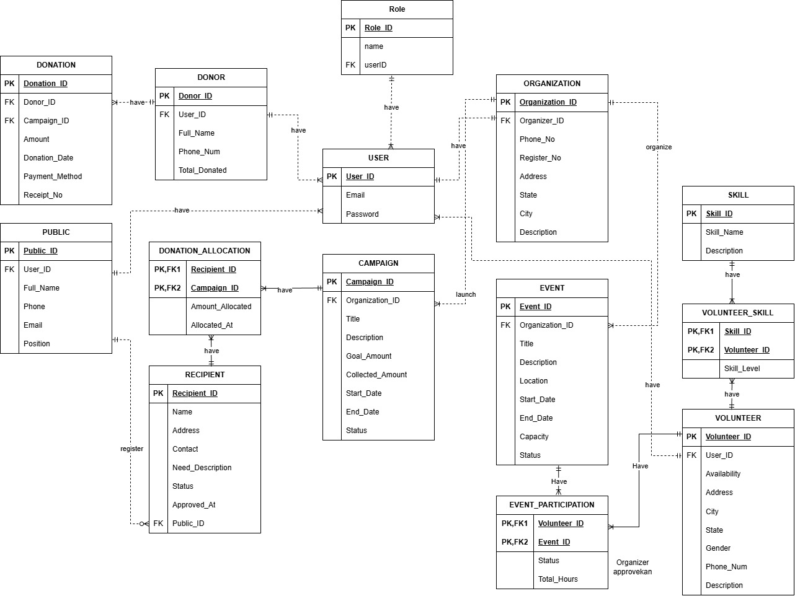

# Charity Platform – Laravel + Breeze + Spatie + PostgreSQL

An event-driven charity management platform built using **Laravel**, **Breeze** for authentication scaffolding, **Spatie Laravel-Permission** for role management, and **PostgreSQL** as the database.  
The system supports donors, organizations, volunteers, campaigns, events, and donation allocations.

---

## 📌 Features

### 🔐 Authentication & Roles
- **Laravel Breeze (Blade)** for authentication UI.
- **Spatie Roles & Permissions**:
    - `admin`
    - `organizer`
    - `volunteer`
    - `donor`
    - `public user`

### 🏛️ Core Modules
- **User Management**  
  Role-based access, linked profiles (Donor, Volunteer, Organization, etc.)
- **Campaign Management**  
  Organizations launch campaigns with goals and collected amounts.
- **Donation & Allocation**  
  Donors donate to campaigns, funds are allocated to recipients.
- **Volunteer Management**  
  Volunteers register skills and participate in events.
- **Events**  
  Organized by organizations, with volunteer participation.
- **Recipients**  
  Registered public members who apply for aid.

---

## 🗂️ Entity–Relationship Diagram (EERD)

The system is structured around multiple connected entities such as Users, Campaigns, Donations, Organizations, Volunteers, and Events.

### 📷 ERD Overview

---

## 🧩 Tech Stack

| Component | Technology |
|-----------|-----------|
| Backend | Laravel 11 |
| Auth | Laravel Breeze |
| Roles | Spatie Laravel-Permission |
| Database | PostgreSQL |
| Frontend | Blade + TailwindCSS |
| Server | Apache/Nginx or Laravel Sail |

---

